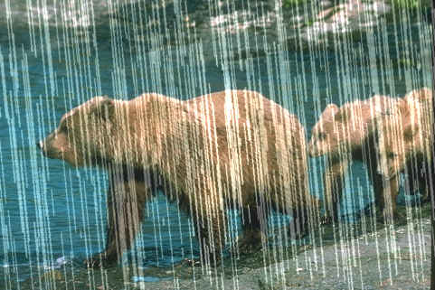
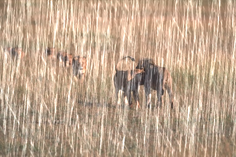
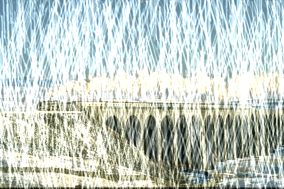
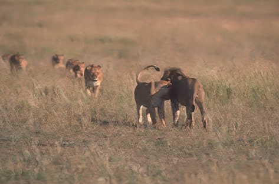
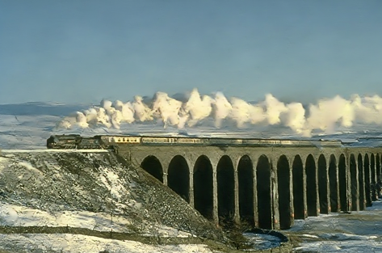
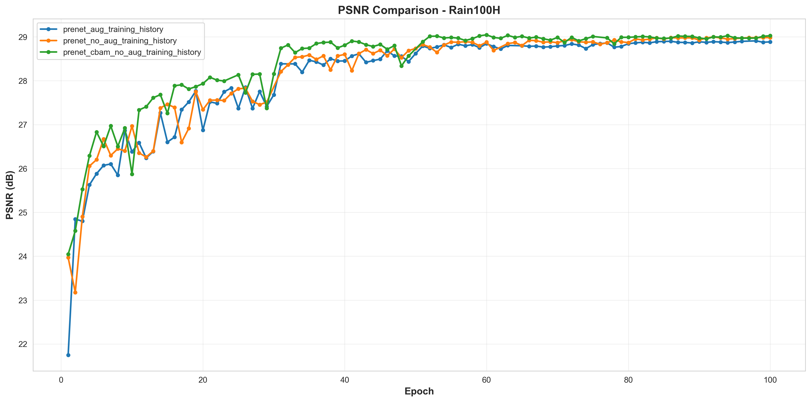
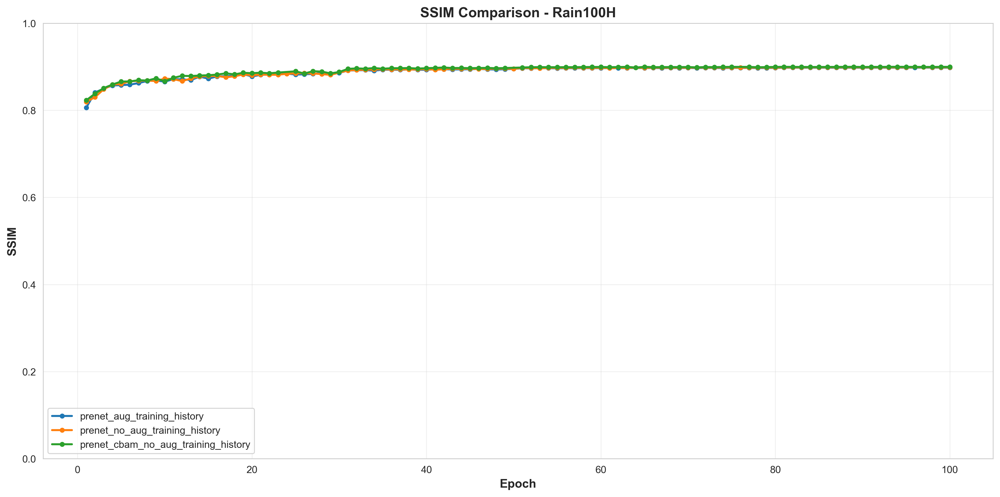

# PReNet: Progressive Image Restoration Network for Rain Removal

A comprehensive implementation of progressive image restoration networks with multiple architectural enhancements for single image rain removal. This project implements and compares several variants of PReNet on two benchmark datasets: **Rain100H** and **Rain1400**.

## Overview

This repository contains implementations of:
- **PReNet** - Progressive Image Restoration Network (baseline)
- **PReNet + CBAM** - Enhanced with Convolutional Block Attention Module
- **PReNet + Perceptual Loss** - With perceptual loss for better visual quality
- **PReNet + CBAM + Perceptual Loss** - Combined attention and perceptual improvements
- **PReNet + CBAM + GAN** - Adversarial training with perceptual enhancement

All models are trained and evaluated on two standard rain removal benchmarks:
- **Rain100H** - 100 high-resolution rainy images with ground truth
- **Rain1400** - 1400 rainy images for comprehensive evaluation

## Project Structure

```
.
├── models/                    # Model implementations
│   ├── PReNet.py             # Base PReNet architecture
│   ├── PReNet_CBAM.py        # PReNet with CBAM attention
│   ├── CBAM.py               # Convolutional Block Attention Module
│   ├── perceptual_loss.py    # Perceptual loss implementation
│   ├── discriminator.py      # GAN discriminator for adversarial training
│   └── __init__.py
├── training/                  # Training scripts
│   ├── train_PreNet_rain1400.py  # Main training script
│   └── __init__.py
├── inference/                 # Inference and testing
│   ├── PreNet_1400.py        # Inference script
│   ├── test/                 # Test images
│   ├── output/               # Inference outputs
│   └── __init__.py
├── evaluation/               # Evaluation metrics
│   ├── evaluate.py           # Evaluation pipeline
│   ├── metric_calculator.py  # PSNR, SSIM calculation
│   ├── psnr.py              # PSNR metric
│   ├── ssim.py              # SSIM metric
│   ├── batch_PSNR.py        # Batch PSNR evaluation
│   └── __init__.py
├── scripts/                  # Utility scripts
│   ├── data/                # Data processing
│   │   ├── dataset.py       # Dataset loading and preparation
│   │   ├── augmentation.py  # Data augmentation pipeline
│   │   └── __init__.py
│   ├── checkpoint/          # Checkpoint management
│   │   ├── load_checkpoint.py
│   │   ├── save_training_history.py
│   │   ├── load_training_history.py
│   │   ├── cleanup_old_models.py
│   │   └── __init__.py
│   └── __init__.py
├── utils/                    # Utility functions
│   ├── helpers.py           # Helper functions
│   ├── image_utils.py       # Image processing utilities
│   ├── metrics.py           # Metric utilities
│   ├── print_network.py     # Network architecture printing
│   └── __init__.py
├── configs/                  # Configuration files
│   └── config.py            # Training configuration
├── data/                     # Dataset directory
│   ├── raw/                 # Raw datasets
│   │   ├── rain100H/
│   │   └── rain1400/
│   └── processed/           # Processed datasets
├── notebooks/               # Jupyter notebooks
│   └── visualization.ipynb  # Results visualization
├── reference/               # Reference papers
└── requirements.txt         # Python dependencies
```

## Key Features

### Model Variants

1. **PReNet (Baseline)**
   - Progressive recurrent restoration with 6 iterations
   - Recurrent convolutional units with gating mechanisms
   - Multi-stage supervision for improved convergence

2. **PReNet + CBAM**
   - Integrates Convolutional Block Attention Module
   - Channel and spatial attention mechanisms
   - Improved feature representation learning

3. **PReNet + Perceptual Loss**
   - VGG-based perceptual loss for better visual quality
   - Combines L1 loss with perceptual similarity
   - Better preservation of image structure and texture

4. **PReNet + CBAM + Perceptual Loss**
   - Combines attention mechanisms with perceptual loss
   - Enhanced feature learning with attention
   - Superior visual quality and PSNR/SSIM metrics

5. **PReNet + CBAM + GAN**
   - Adversarial training with discriminator
   - Perceptual enhancement through adversarial loss
   - State-of-the-art visual quality

### Training Features

- **Multi-stage Supervision**: Loss computed at all recurrent iterations
- **Curriculum Learning**: Progressive augmentation strategy across training stages
- **Data Augmentation**: 
  - Basic augmentation (rotation, flip)
  - Rain streak augmentation
  - MixUp augmentation
- **Learning Rate Scheduling**: MultiStepLR with milestone-based decay
- **Checkpoint Management**: Automatic model saving and cleanup
- **Training History Tracking**: Epoch-wise metrics logging

### Evaluation Metrics

- **PSNR** (Peak Signal-to-Noise Ratio)
- **SSIM** (Structural Similarity Index)
- Batch evaluation support

## Installation

### Requirements

- Python 3.8+
- CUDA 11.0+ (for GPU acceleration)
- PyTorch 1.9+

### Setup

1. Clone the repository:
```bash
git clone https://github.com/ctthong18/ImageDerainingPrenet.git
cd ImageDerainingPrenet
```

2. Install dependencies:
```bash
pip install -r requirements.txt
```

3. Download datasets:
   - Rain100H: [Download Link](https://github.com/csdwren/PReNet)
   - Rain1400: [Download Link](https://github.com/csdwren/PReNet)

4. Extract datasets to `data/raw/`:
```
data/raw/
├── rain100H/
│   ├── rain/
│   └── norain/
└── rain1400/
    ├── rain/
    └── norain/
```

## Configuration

Edit `configs/config.py` to customize training parameters:

```python
# Data paths
data_path = 'data/raw/rain1400'
train_data_path = 'data/processed/rain1400'

# Training parameters
batch_size = 8
epochs = 100
lr = 0.001
recurrent_iter = 6

# Augmentation
use_augmentation = True
use_curriculum = True

# Hardware
use_gpu = True

# Model saving
save_path = 'inference/'
save_freq = 10
```

## Training

### Train PReNet on Rain1400:

```bash
python training/train_PreNet_rain1400.py
```

### Train with Custom Configuration:

Edit `configs/config.py` and run:
```bash
python training/train_PreNet_rain1400.py
```

### Resume Training:

The training script automatically resumes from the latest checkpoint if available.

## Inference

### Single Image Inference:

```bash
python inference/PreNet_1400.py --input <image_path> --model <model_path> --output <output_path>
```

### Batch Inference:

```bash
python inference/PreNet_1400.py --input_dir <directory> --model <model_path> --output_dir <output_directory>
```

<p align="center">
  
  
  
</p>

<p align="center"><b>Đầu vào</b></p>

<p align="center">
  
  
  
</p>

<p align="center"><b>Đầu ra</b></p>


## Results

Results will be documented here after training completion. Metrics include:
- PSNR (dB)
- SSIM
- Visual quality comparison
- Inference time




## Architecture Details

### PReNet Core Components

- **Recurrent Convolutional Units**: 6 iterations of progressive refinement
- **Gating Mechanisms**: Input and forget gates for recurrent connections
- **Multi-scale Processing**: Feature extraction at multiple scales
- **Residual Connections**: Skip connections for improved gradient flow

### CBAM Attention Module

- **Channel Attention**: Adaptive feature recalibration
- **Spatial Attention**: Spatial feature refinement
- **Lightweight Design**: Minimal computational overhead

### Perceptual Loss

- **VGG-based Features**: Pre-trained VGG19 for perceptual similarity
- **Multi-layer Loss**: Loss computed at multiple VGG layers
- **Content Preservation**: Better structural and textural fidelity

## Training Details

- **Optimizer**: Adam (β₁=0.9, β₂=0.999)
- **Learning Rate**: 0.001 with MultiStepLR scheduling
- **Loss Function**: Multi-stage L1 + MSE (0.5 each)
- **Batch Size**: 8
- **Epochs**: 100
- **Data Augmentation**: Progressive curriculum learning

## Performance Considerations

- **GPU Memory**: ~4GB for batch size 8 with 256×256 images
- **Training Time**: ~24-48 hours per model on single GPU
- **Inference Speed**: ~50-100ms per image (256×256)

## References

- **PReNet**: [Progressive Image Restoration Network for Single Image Deraining](https://github.com/csdwren/PReNet)
- **CBAM**: [CBAM: Convolutional Block Attention Module](https://arxiv.org/abs/1807.06521)
- **Perceptual Loss**: [Perceptual Losses for Real-Time Style Transfer and Super-Resolution](https://arxiv.org/abs/1603.08155)
- **GAN**: [Generative Adversarial Networks](https://arxiv.org/abs/1406.2661)

## Citation

If you use this code in your research, please cite the original PReNet paper:

```bibtex
@inproceedings{ren2019progressive,
  title={Progressive Image Restoration through Conditional Treatment},
  author={Ren, Dongwei and Zuo, Wangmei and Hu, Qinghua and Zhu, Pengfei and Meng, Deyu},
  booktitle={CVPR},
  year={2019}
}
```

## License

This project is provided for research and educational purposes.

## Acknowledgments

- Original PReNet implementation: [csdwren/PReNet](https://github.com/csdwren/PReNet)
- CBAM implementation inspired by official repository
- Evaluation metrics based on standard image quality assessment

## Contact & Support

For questions or issues, please open an issue in the repository.

---

**Last Updated**: January 2026
